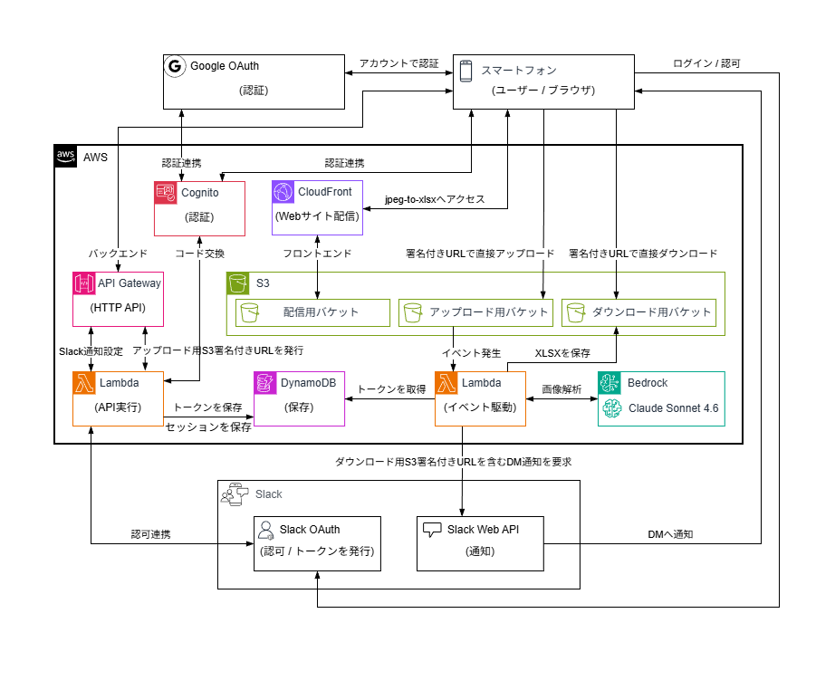
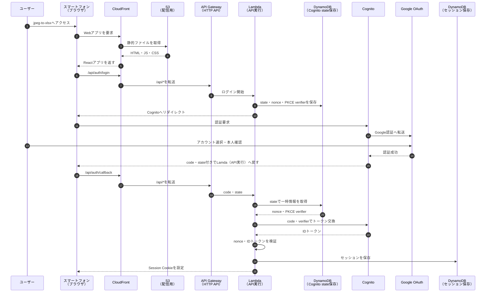
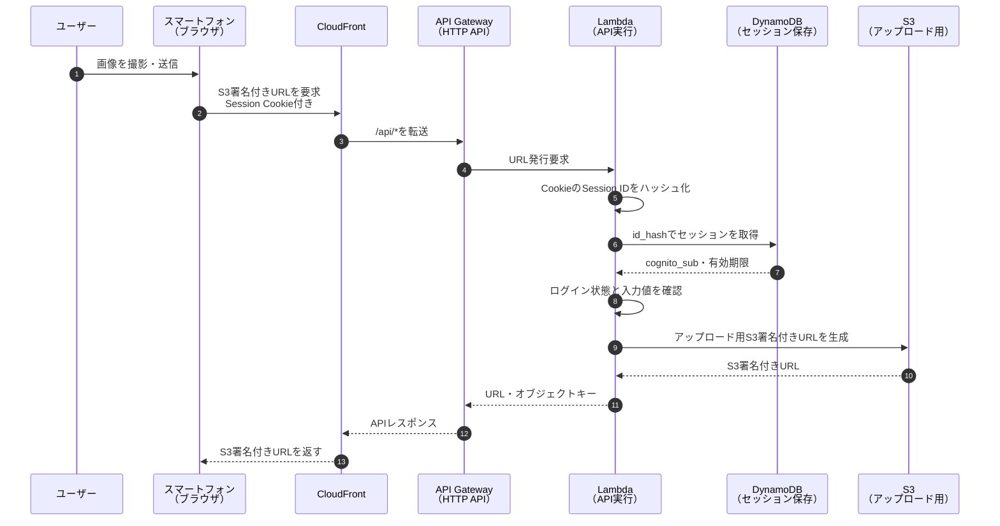
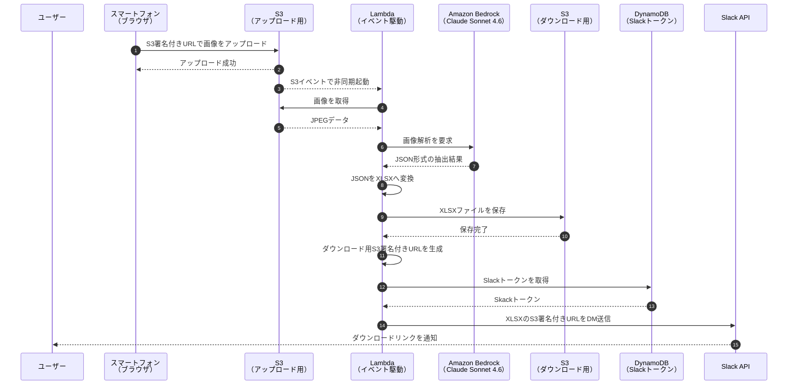
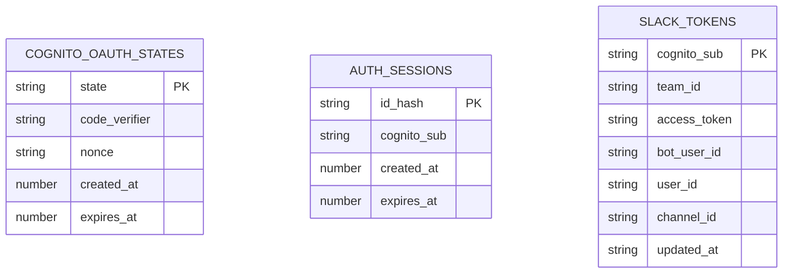

# jpeg-to-xlsx

## 1. 概要

- スマートフォンで撮影した画像から文字情報を抽出し、Excelファイルへ変換するWebアプリです。
- ExcelファイルをダウンロードするURLを、SlackのDMへ通知します。

## 2. デモ（YouTubeショート / 音声あり）

**※公開時に撮影したデモです。現在、Webアプリの公開は停止しています。**

## 3. システム構成

## 4. ログイン経路

## 5. アップロード用S3署名付きURL取得経路

## 6. Slack通知経路

## 7. DynamoDBテーブル構成

## 8. 開発目的

- 紙媒体に記載された文字情報をExcelに変換することで、データ入力や転記に伴う作業の効率化を支援することを目的としています。

## 9. 技術スタック

### 開発基盤
  | 項目 | 技術 |
  | :--- | :--- |
  | 開発環境 | Docker |
  | OS | Debian 13 |
  | ソース管理 | Git |
  | リポジトリ | GitHub |
  | CI/CD | GitHub Actions |

### バックエンド
  | 項目 | 技術 |
  | :--- | :--- |
  | 開発言語 | Go 1.26.3 |
  | 認可連携 | Slack OAuth |
  | 通知連携 | Slack Web API |
  | 生成AI基盤 | Amazon Bedrock |
  | 生成AIモデル | Claude Sonnet 4.6 |

### フロントエンド
  | 項目 | 技術 |
  | :--- | :--- |
  | 開発言語 | TypeScript 6.0.3 |
  | UIライブラリ | React 19.2.7 |
  | ビルドツール | Vite 8.1.0 |
  | ビルド環境 | Node.js 24.19.0 |

### インフラ（AWS）
  | 項目 | 技術 |
  | :--- | :--- |
  | 開発言語 | TypeScript 6.0.3 |
  | IaC | CloudFormation |
  | IaCフレームワーク | AWS CDK (aws-cdk-lib 2.263.0) |
  | IaC CLI | AWS CDK CLI 2.1127.0 |
  | AWS CDK実行環境 | Node.js 24.19.0 |
  | 配信基盤 | CloudFront |
  | 認証基盤 | Cognito |
  | オブジェクトストレージ | S3 |
  | API基盤 | API Gateway |
  | APIタイプ | HTTP API |
  | 実行基盤 | Lambda |
  | データベース | DynamoDB |
  | 秘匿情報管理 | AWS Secrets Manager |

## 10. 技術選定

- AWSが提供するIaCサービス、CloudFormationを採用しました。

- CloudFormationテンプレートを生成することができるIaCフレームワーク、AWS CDKを採用しました。

- AWS公式ドキュメントやAWS CDKのTypeScript向けサンプルが充実しているため、インフラの開発言語にTypeScriptを採用しました。

- スマートフォンでの撮影・プレビュー・アップロード・結果表示のUIと画面状態を管理するため、UIライブラリであるReactを採用しました。

- コンパイル型言語による実行性能とLambdaとの親和性を考慮し、バックエンドの開発言語にGoを採用しました。

- Googleアカウントによるログインを実現し、アプリケーションの認証情報を一元管理するため、認証基盤としてAmazon Cognitoを採用しました。

- 画像内の文字情報をJSON形式に構造化する精度と運用コストのバランスを考慮し、生成AIモデルにClaude Sonnet 4.6を採用しました。

- CloudFrontを採用し、フロントエンドの配信とバックエンドへのアクセスを同一ドメインにまとめました。

- S3を採用し、アップロード用S3署名付きURLを用いてブラウザから撮影画像を直接アップロードする構成としました。

- Slackを採用し、画像解析完了後にダウンロード用S3署名付きURLをDMへ通知する構成としました。

- Slackとの認可連携を行うため、Slack OAuthを採用しました。

- Slack OAuthのクライアントシークレットを安全に管理するため、AWS Secrets Managerを採用しました。

- Slack OAuthで取得したアクセストークンをサーバーレスで管理するため、データベースにDynamoDBを採用しました。

## 11. ライセンス

- 本リポジトリは [MIT License](./LICENSE) のもとで公開しています。
